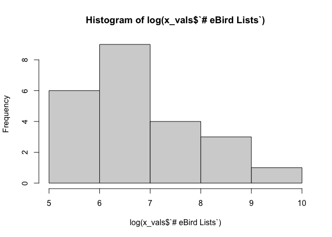

Sandhills Gaps
================
Jacob C. Cooper, Cody McGregor & Nathan Eidem
2024-01-23

``` r
library(tidyverse)
```

    ## ── Attaching core tidyverse packages ──────────────────────── tidyverse 2.0.0 ──
    ## ✔ dplyr     1.1.3     ✔ readr     2.1.4
    ## ✔ forcats   1.0.0     ✔ stringr   1.5.0
    ## ✔ ggplot2   3.4.4     ✔ tibble    3.2.1
    ## ✔ lubridate 1.9.3     ✔ tidyr     1.3.0
    ## ✔ purrr     1.0.2     
    ## ── Conflicts ────────────────────────────────────────── tidyverse_conflicts() ──
    ## ✖ dplyr::filter() masks stats::filter()
    ## ✖ dplyr::lag()    masks stats::lag()
    ## ℹ Use the conflicted package (<http://conflicted.r-lib.org/>) to force all conflicts to become errors

``` r
x <- read_csv(paste0(filepath,"Sandhills_Gaps.csv"))
```

    ## Rows: 25 Columns: 14
    ## ── Column specification ────────────────────────────────────────────────────────
    ## Delimiter: ","
    ## chr (9): County, Rough-legged Hawk, Snowy Owl, Gyrfalcon, Mountain Bluebird,...
    ## dbl (5): Total, # eBird Lists, Pop Density / Mile, Ratio List/Pop, Norm Ratio
    ## 
    ## ℹ Use `spec()` to retrieve the full column specification for this data.
    ## ℹ Specify the column types or set `show_col_types = FALSE` to quiet this message.

``` r
percents <- x[nrow(x),] %>% t()

percents <- percents[2:9,]
```

``` r
percents
```

    ##    Rough-legged Hawk            Snowy Owl            Gyrfalcon 
    ##              "1.000"              "0.522"              "0.304" 
    ##    Mountain Bluebird Townsend's Solitaire       Common Redpoll 
    ##              "0.783"              "0.957"              "0.783" 
    ##     Lapland Longspur         Snow Bunting 
    ##              "1.000"              "0.739"

We have the most recorded species as:

1.  Rough-legged Hawk *Buteo lagopus*
2.  Lapland Longspur *Calcarius lapponicus*
3.  Townsend’s Solitaire *Myadestes townsendi*
4.  Mountain Bluebird *Sialia currucoides* & Common Redpoll *Acanthis
    flammea* (tie)
5.  Snow Bunting *Plectrophenax nivalis*
6.  Snowy Owl *Bubo scandiaca*
7.  Gyrfalcon *Falco rusticolus*

This isn’t wholly surprising, based on overall commonality. However, we
want to look at how often things are observed based on human effort. We
are assuming that all species have occurred in all counties, based on
latitude, previous records, and on habitat.

``` r
x_vals <- x[c(1:(nrow(x)-2)),]

plot(y=x_vals$Total,x=x_vals$`# eBird Lists`,
     ylab = ("Total Species"),xlab = "Lists",
     pch=19)
```

<!-- -->

``` r
summary(x_vals$`# eBird Lists`)
```

    ##    Min. 1st Qu.  Median    Mean 3rd Qu.    Max. 
    ##   219.0   424.5   791.0  2172.0  1485.0 21817.0

``` r
summary(x_vals$`# eBird Lists`)
```

    ##    Min. 1st Qu.  Median    Mean 3rd Qu.    Max. 
    ##   219.0   424.5   791.0  2172.0  1485.0 21817.0

``` r
plot(x = log(x_vals$`Pop Density / Mile`),
     y = log(x_vals$`# eBird Lists`),
     pch=19,
     xlab = "Log of Pop Density / Mile",
     ylab = "Log of Lists")
```

<!-- -->

``` r
plot(y=x_vals$Total,x=log(x_vals$`# eBird Lists`),
     ylab = ("Total Species"),xlab = "Log Lists per Population",
     pch=19)
```

<!-- -->

``` r
hist(x_vals$Total)
```

<!-- -->

``` r
hist(log(x_vals$`# eBird Lists`))
```

<!-- -->

Data appear approximately normal, so moving forward with linear
regression.

``` r
r <- cor(y=x_vals$Total,x=log(x_vals$`# eBird Lists`))
print(r)
```

    ## [1] 0.694468

``` r
print(r^2)
```

    ## [1] 0.4822858

Fair amount of noise, but positive correlation. Not a huge amount of
explanatory power.

``` r
sandhills.lm <- lm(data = x_vals,Total ~ log(`# eBird Lists`))

summary(sandhills.lm)
```

    ## 
    ## Call:
    ## lm(formula = Total ~ log(`# eBird Lists`), data = x_vals)
    ## 
    ## Residuals:
    ##      Min       1Q   Median       3Q      Max 
    ## -0.22875 -0.06797 -0.00476  0.06706  0.35592 
    ## 
    ## Coefficients:
    ##                      Estimate Std. Error t value Pr(>|t|)    
    ## (Intercept)           0.08390    0.15501   0.541 0.594038    
    ## log(`# eBird Lists`)  0.09874    0.02232   4.423 0.000236 ***
    ## ---
    ## Signif. codes:  0 '***' 0.001 '**' 0.01 '*' 0.05 '.' 0.1 ' ' 1
    ## 
    ## Residual standard error: 0.1175 on 21 degrees of freedom
    ## Multiple R-squared:  0.4823, Adjusted R-squared:  0.4576 
    ## F-statistic: 19.56 on 1 and 21 DF,  p-value: 0.0002363

``` r
y <- x_vals$Total
x <- log(x_vals$`# eBird Lists`)

sandhills.lm <- lm(y ~ log(x))

x1 <- data.frame(seq(1,max(x),length.out=1000))
colnames(x1)  <-  "x"
y1 <- predict(sandhills.lm,newdata=x1,
              interval="confidence")

plot(y=x_vals$Total,x=log(x_vals$`# eBird Lists`),
     ylab = ("Total Species"),xlab = "Lists",
     pch=19)
matlines(x1,y1,lwd=2)
```

<!-- -->

What happens if we remove Cherry County, the effort outlier?

``` r
x_nolincoln <- x_vals[-which(x_vals$County=="Cherry"),]

y <- x_nolincoln$Total
x <- x_nolincoln$`# eBird Lists`

r <- cor(x=log(x),y=y)
print(r)
```

    ## [1] 0.6577584

``` r
print(r^2)
```

    ## [1] 0.4326461

Less explanatory power with outlier removed.

``` r
sandhills.lm <- lm(y ~ log(x))

summary(sandhills.lm)
```

    ## 
    ## Call:
    ## lm(formula = y ~ log(x))
    ## 
    ## Residuals:
    ##      Min       1Q   Median       3Q      Max 
    ## -0.22675 -0.05968 -0.00383  0.05868  0.35349 
    ## 
    ## Coefficients:
    ##             Estimate Std. Error t value Pr(>|t|)    
    ## (Intercept)  0.11566    0.16440   0.704 0.489854    
    ## log(x)       0.09357    0.02396   3.905 0.000878 ***
    ## ---
    ## Signif. codes:  0 '***' 0.001 '**' 0.01 '*' 0.05 '.' 0.1 ' ' 1
    ## 
    ## Residual standard error: 0.1191 on 20 degrees of freedom
    ## Multiple R-squared:  0.4326, Adjusted R-squared:  0.4043 
    ## F-statistic: 15.25 on 1 and 20 DF,  p-value: 0.0008778

``` r
x1 <- data.frame(seq(1,max(x),length.out=1000))
colnames(x1)  <-  "x"
y1 <- predict(sandhills.lm,newdata=x1,
              interval="confidence")

plot(y=x_nolincoln$Total,x=x_nolincoln$`# eBird Lists`,
     ylab = ("Total Species"),xlab = "Lists",
     pch=19)
matlines(x1,y1,lwd=2)
```

<!-- -->

# Individual Species vs. County

For each species, let’s look at the spread of checklist numbers.

``` r
rlha <- x_vals[which(x_vals$`Rough-legged Hawk`=="X"),]
snow <- x_vals[which(x_vals$`Snowy Owl`=="X"),]
gyrf <- x_vals[which(x_vals$Gyrfalcon=="X"),]
mobl <- x_vals[which(x_vals$`Mountain Bluebird`=="X"),]
toso <- x_vals[which(x_vals$`Townsend's Solitaire`=="X"),]
core <- x_vals[which(x_vals$`Common Redpoll`=="X"),]
lalo <- x_vals[which(x_vals$`Lapland Longspur`=="X"),]
snbu <- x_vals[which(x_vals$`Snow Bunting`=="X"),]
```

``` r
rlha_norm <- rlha$`Norm Ratio`
snow_norm <- snow$`Norm Ratio`
gyrf_norm <- gyrf$`Norm Ratio`
mobl_norm <- mobl$`Norm Ratio`
toso_norm <- toso$`Norm Ratio`
core_norm <- core$`Norm Ratio`
lalo_norm <- lalo$`Norm Ratio`
snbu_norm <- snbu$`Norm Ratio`
```

We have different counts for everything, so we are going to do pairwise
tests, Not necessarily “best practice”, but we are specifically
interested in what is different. These should default to non-parametric,
especially since we have such non-continuous values.

``` r
# RLHA
wilcox.test(x = rlha_norm,y = snow_norm,alternative = "l",conf.level = 0.1)
```

    ## Warning in wilcox.test.default(x = rlha_norm, y = snow_norm, alternative = "l",
    ## : cannot compute exact p-value with ties

    ## 
    ##  Wilcoxon rank sum test with continuity correction
    ## 
    ## data:  rlha_norm and snow_norm
    ## W = 121, p-value = 0.283
    ## alternative hypothesis: true location shift is less than 0

``` r
wilcox.test(x = rlha_norm,y = gyrf_norm,alternative = "l",conf.level = 0.1)
```

    ## Warning in wilcox.test.default(x = rlha_norm, y = gyrf_norm, alternative = "l",
    ## : cannot compute exact p-value with ties

    ## 
    ##  Wilcoxon rank sum test with continuity correction
    ## 
    ## data:  rlha_norm and gyrf_norm
    ## W = 63.5, p-value = 0.2091
    ## alternative hypothesis: true location shift is less than 0

``` r
wilcox.test(x = rlha_norm,y = mobl_norm,alternative = "l",conf.level = 0.1)
```

    ## Warning in wilcox.test.default(x = rlha_norm, y = mobl_norm, alternative = "l",
    ## : cannot compute exact p-value with ties

    ## 
    ##  Wilcoxon rank sum test with continuity correction
    ## 
    ## data:  rlha_norm and mobl_norm
    ## W = 162, p-value = 0.121
    ## alternative hypothesis: true location shift is less than 0

``` r
wilcox.test(x = rlha_norm,y = toso_norm,alternative = "l",conf.level = 0.1)
```

    ## Warning in wilcox.test.default(x = rlha_norm, y = toso_norm, alternative = "l",
    ## : cannot compute exact p-value with ties

    ## 
    ##  Wilcoxon rank sum test with continuity correction
    ## 
    ## data:  rlha_norm and toso_norm
    ## W = 245, p-value = 0.4323
    ## alternative hypothesis: true location shift is less than 0

``` r
wilcox.test(x = rlha_norm,y = core_norm,alternative = "l",conf.level = 0.1)
```

    ## Warning in wilcox.test.default(x = rlha_norm, y = core_norm, alternative = "l",
    ## : cannot compute exact p-value with ties

    ## 
    ##  Wilcoxon rank sum test with continuity correction
    ## 
    ## data:  rlha_norm and core_norm
    ## W = 193, p-value = 0.3613
    ## alternative hypothesis: true location shift is less than 0

``` r
wilcox.test(x = rlha_norm,y = lalo_norm,alternative = "l",conf.level = 0.1)
```

    ## Warning in wilcox.test.default(x = rlha_norm, y = lalo_norm, alternative = "l",
    ## : cannot compute exact p-value with ties

    ## 
    ##  Wilcoxon rank sum test with continuity correction
    ## 
    ## data:  rlha_norm and lalo_norm
    ## W = 264.5, p-value = 0.5044
    ## alternative hypothesis: true location shift is less than 0

``` r
wilcox.test(x = rlha_norm,y = snbu_norm,alternative = "l",conf.level = 0.1)
```

    ## Warning in wilcox.test.default(x = rlha_norm, y = snbu_norm, alternative = "l",
    ## : cannot compute exact p-value with ties

    ## 
    ##  Wilcoxon rank sum test with continuity correction
    ## 
    ## data:  rlha_norm and snbu_norm
    ## W = 197.5, p-value = 0.5273
    ## alternative hypothesis: true location shift is less than 0

``` r
# SNOW
wilcox.test(x = snow_norm,y = gyrf_norm,alternative = "l",conf.level = 0.1)
```

    ## Warning in wilcox.test.default(x = snow_norm, y = gyrf_norm, alternative = "l",
    ## : cannot compute exact p-value with ties

    ## 
    ##  Wilcoxon rank sum test with continuity correction
    ## 
    ## data:  snow_norm and gyrf_norm
    ## W = 38, p-value = 0.3835
    ## alternative hypothesis: true location shift is less than 0

``` r
wilcox.test(x = snow_norm,y = mobl_norm,alternative = "g",conf.level = 0.1)
```

    ## Warning in wilcox.test.default(x = snow_norm, y = mobl_norm, alternative = "g",
    ## : cannot compute exact p-value with ties

    ## 
    ##  Wilcoxon rank sum test with continuity correction
    ## 
    ## data:  snow_norm and mobl_norm
    ## W = 103, p-value = 0.5921
    ## alternative hypothesis: true location shift is greater than 0

``` r
wilcox.test(x = snow_norm,y = toso_norm,alternative = "g",conf.level = 0.1)
```

    ## Warning in wilcox.test.default(x = snow_norm, y = toso_norm, alternative = "g",
    ## : cannot compute exact p-value with ties

    ## 
    ##  Wilcoxon rank sum test with continuity correction
    ## 
    ## data:  snow_norm and toso_norm
    ## W = 145.5, p-value = 0.3196
    ## alternative hypothesis: true location shift is greater than 0

``` r
wilcox.test(x = snow_norm,y = core_norm,alternative = "g",conf.level = 0.1)
```

    ## Warning in wilcox.test.default(x = snow_norm, y = core_norm, alternative = "g",
    ## : cannot compute exact p-value with ties

    ## 
    ##  Wilcoxon rank sum test with continuity correction
    ## 
    ## data:  snow_norm and core_norm
    ## W = 114, p-value = 0.4078
    ## alternative hypothesis: true location shift is greater than 0

``` r
wilcox.test(x = snow_norm,y = lalo_norm,alternative = "g",conf.level = 0.1)
```

    ## Warning in wilcox.test.default(x = snow_norm, y = lalo_norm, alternative = "g",
    ## : cannot compute exact p-value with ties

    ## 
    ##  Wilcoxon rank sum test with continuity correction
    ## 
    ## data:  snow_norm and lalo_norm
    ## W = 155, p-value = 0.283
    ## alternative hypothesis: true location shift is greater than 0

``` r
wilcox.test(x = snow_norm,y = snbu_norm,alternative = "g",conf.level = 0.1)
```

    ## Warning in wilcox.test.default(x = snow_norm, y = snbu_norm, alternative = "g",
    ## : cannot compute exact p-value with ties

    ## 
    ##  Wilcoxon rank sum test with continuity correction
    ## 
    ## data:  snow_norm and snbu_norm
    ## W = 117, p-value = 0.2602
    ## alternative hypothesis: true location shift is greater than 0

``` r
# GYRF
wilcox.test(x = gyrf_norm,y = mobl_norm,alternative = "g",conf.level = 0.1)
```

    ## Warning in wilcox.test.default(x = gyrf_norm, y = mobl_norm, alternative = "g",
    ## : cannot compute exact p-value with ties

    ## 
    ##  Wilcoxon rank sum test with continuity correction
    ## 
    ## data:  gyrf_norm and mobl_norm
    ## W = 62.5, p-value = 0.5242
    ## alternative hypothesis: true location shift is greater than 0

``` r
wilcox.test(x = gyrf_norm,y = toso_norm,alternative = "g",conf.level = 0.1)
```

    ## Warning in wilcox.test.default(x = gyrf_norm, y = toso_norm, alternative = "g",
    ## : cannot compute exact p-value with ties

    ## 
    ##  Wilcoxon rank sum test with continuity correction
    ## 
    ## data:  gyrf_norm and toso_norm
    ## W = 90.5, p-value = 0.2536
    ## alternative hypothesis: true location shift is greater than 0

``` r
wilcox.test(x = gyrf_norm,y = core_norm,alternative = "g",conf.level = 0.1)
```

    ## Warning in wilcox.test.default(x = gyrf_norm, y = core_norm, alternative = "g",
    ## : cannot compute exact p-value with ties

    ## 
    ##  Wilcoxon rank sum test with continuity correction
    ## 
    ## data:  gyrf_norm and core_norm
    ## W = 72, p-value = 0.3033
    ## alternative hypothesis: true location shift is greater than 0

``` r
wilcox.test(x = gyrf_norm,y = lalo_norm,alternative = "g",conf.level = 0.1)
```

    ## Warning in wilcox.test.default(x = gyrf_norm, y = lalo_norm, alternative = "g",
    ## : cannot compute exact p-value with ties

    ## 
    ##  Wilcoxon rank sum test with continuity correction
    ## 
    ## data:  gyrf_norm and lalo_norm
    ## W = 97.5, p-value = 0.2091
    ## alternative hypothesis: true location shift is greater than 0

``` r
wilcox.test(x = gyrf_norm,y = snbu_norm,alternative = "g",conf.level = 0.1)
```

    ## Warning in wilcox.test.default(x = gyrf_norm, y = snbu_norm, alternative = "g",
    ## : cannot compute exact p-value with ties

    ## 
    ##  Wilcoxon rank sum test with continuity correction
    ## 
    ## data:  gyrf_norm and snbu_norm
    ## W = 72.5, p-value = 0.2134
    ## alternative hypothesis: true location shift is greater than 0

``` r
# MOBL
wilcox.test(x = mobl_norm,y = toso_norm,alternative = "l",conf.level = 0.1)
```

    ## Warning in wilcox.test.default(x = mobl_norm, y = toso_norm, alternative = "l",
    ## : cannot compute exact p-value with ties

    ## 
    ##  Wilcoxon rank sum test with continuity correction
    ## 
    ## data:  mobl_norm and toso_norm
    ## W = 234, p-value = 0.8397
    ## alternative hypothesis: true location shift is less than 0

``` r
wilcox.test(x = mobl_norm,y = core_norm,alternative = "l",conf.level = 0.1)
```

    ## Warning in wilcox.test.default(x = mobl_norm, y = core_norm, alternative = "l",
    ## : cannot compute exact p-value with ties

    ## 
    ##  Wilcoxon rank sum test with continuity correction
    ## 
    ## data:  mobl_norm and core_norm
    ## W = 185, p-value = 0.7716
    ## alternative hypothesis: true location shift is less than 0

``` r
wilcox.test(x = mobl_norm,y = lalo_norm,alternative = "g",conf.level = 0.1)
```

    ## Warning in wilcox.test.default(x = mobl_norm, y = lalo_norm, alternative = "g",
    ## : cannot compute exact p-value with ties

    ## 
    ##  Wilcoxon rank sum test with continuity correction
    ## 
    ## data:  mobl_norm and lalo_norm
    ## W = 252, p-value = 0.121
    ## alternative hypothesis: true location shift is greater than 0

``` r
wilcox.test(x = mobl_norm,y = snbu_norm,conf.level = 0.1)
```

    ## Warning in wilcox.test.default(x = mobl_norm, y = snbu_norm, conf.level = 0.1):
    ## cannot compute exact p-value with ties

    ## 
    ##  Wilcoxon rank sum test with continuity correction
    ## 
    ## data:  mobl_norm and snbu_norm
    ## W = 186.5, p-value = 0.2756
    ## alternative hypothesis: true location shift is not equal to 0

``` r
# TOSO
wilcox.test(x = toso_norm,y = core_norm,alternative = "l",conf.level = 0.1)
```

    ## Warning in wilcox.test.default(x = toso_norm, y = core_norm, alternative = "l",
    ## : cannot compute exact p-value with ties

    ## 
    ##  Wilcoxon rank sum test with continuity correction
    ## 
    ## data:  toso_norm and core_norm
    ## W = 190.5, p-value = 0.4245
    ## alternative hypothesis: true location shift is less than 0

``` r
wilcox.test(x = toso_norm,y = lalo_norm,alternative = "g",conf.level = 0.1)
```

    ## Warning in wilcox.test.default(x = toso_norm, y = lalo_norm, alternative = "g",
    ## : cannot compute exact p-value with ties

    ## 
    ##  Wilcoxon rank sum test with continuity correction
    ## 
    ## data:  toso_norm and lalo_norm
    ## W = 261, p-value = 0.4323
    ## alternative hypothesis: true location shift is greater than 0

``` r
wilcox.test(x = toso_norm,y = snbu_norm,alternative = "g",conf.level = 0.1)
```

    ## Warning in wilcox.test.default(x = toso_norm, y = snbu_norm, alternative = "g",
    ## : cannot compute exact p-value with ties

    ## 
    ##  Wilcoxon rank sum test with continuity correction
    ## 
    ## data:  toso_norm and snbu_norm
    ## W = 194.5, p-value = 0.4214
    ## alternative hypothesis: true location shift is greater than 0

``` r
# CORE
wilcox.test(x = core_norm,y = lalo_norm,alternative = "g",conf.level = 0.1)
```

    ## Warning in wilcox.test.default(x = core_norm, y = lalo_norm, alternative = "g",
    ## : cannot compute exact p-value with ties

    ## 
    ##  Wilcoxon rank sum test with continuity correction
    ## 
    ## data:  core_norm and lalo_norm
    ## W = 221, p-value = 0.3613
    ## alternative hypothesis: true location shift is greater than 0

``` r
wilcox.test(x = core_norm,y = snbu_norm,alternative = "g",conf.level = 0.1)
```

    ## Warning in wilcox.test.default(x = core_norm, y = snbu_norm, alternative = "g",
    ## : cannot compute exact p-value with ties

    ## 
    ##  Wilcoxon rank sum test with continuity correction
    ## 
    ## data:  core_norm and snbu_norm
    ## W = 165, p-value = 0.352
    ## alternative hypothesis: true location shift is greater than 0

``` r
# LALO
wilcox.test(x = lalo_norm,y = snbu_norm,alternative = "l",conf.level = 0.1)
```

    ## Warning in wilcox.test.default(x = lalo_norm, y = snbu_norm, alternative = "l",
    ## : cannot compute exact p-value with ties

    ## 
    ##  Wilcoxon rank sum test with continuity correction
    ## 
    ## data:  lalo_norm and snbu_norm
    ## W = 197.5, p-value = 0.5273
    ## alternative hypothesis: true location shift is less than 0

# Boxplot

``` r
formatter <- function(dat,name){
  dat <- dat %>% data_frame()
  colnames(dat) <- "Norm"
  dat$Species <- name
  return(dat)
}

rlha_norm <- formatter(rlha_norm,"RLHA")
```

    ## Warning: `data_frame()` was deprecated in tibble 1.1.0.
    ## ℹ Please use `tibble()` instead.
    ## This warning is displayed once every 8 hours.
    ## Call `lifecycle::last_lifecycle_warnings()` to see where this warning was
    ## generated.

``` r
snow_norm <- formatter(snow_norm,"SNOW")
gyrf_norm <- formatter(gyrf_norm,"GYRF")
mobl_norm <- formatter(mobl_norm,"MOBL")
toso_norm <- formatter(toso_norm,"TOSO")
core_norm <- formatter(core_norm,"CORE")
lalo_norm <- formatter(lalo_norm,"LALO")
snbu_norm <- formatter(snbu_norm,"SNBU")

all_norm <- rbind(rlha_norm,snow_norm,
                  gyrf_norm,mobl_norm,
                  toso_norm,core_norm,
                  lalo_norm,snbu_norm)

all_norm$Species <- as.factor(all_norm$Species)

p <- ggplot(all_norm, aes(x=Species, y=Norm)) + 
  geom_boxplot()

print(p)
```

<!-- -->

Let’s remove the highest county, Cherry.

``` r
all_norm_low <- all_norm %>%
  filter(Norm < 1)

p <- ggplot(all_norm_low, aes(x=Species, y=Norm)) + 
  geom_boxplot()
print(p)
```

<!-- -->
